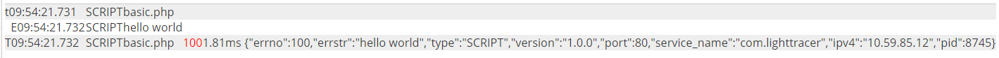
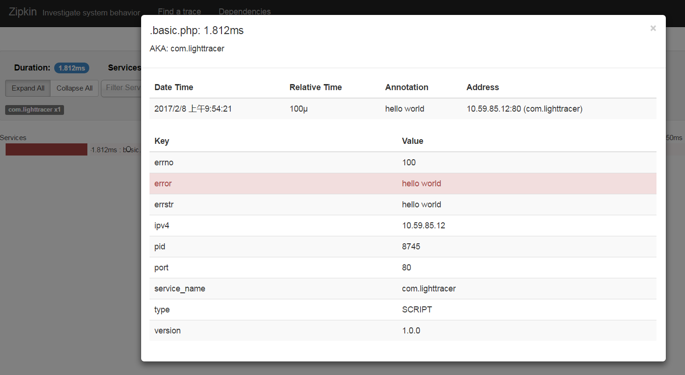

LightTracer
===
* 想统计API的调用次数、成功率、平均耗时
* 想查询出错信息、严重错误时告警
* 想分析请求链路上 性能瓶颈，调用依赖关系
* 不想 影响现有业务的性能

市面上的产品

* CAT 优点：有统计和告警功能； 缺点：没有调用关系依赖分析， 为JAVA而生，高度耦合的SDK，性能差
* Zipkin 优点：有调用关系依赖分析，链路性能一目了然；缺点：没有统计和告警， 同样为JAVA而生，高度耦合的SDK，性能差
* ES 优点：配置简单，可以统计 缺点：功能过于简单，不能分析依赖关系

总结下来：大部分的产品是针对JAVA，提供高度耦合的SDK，以后要移除或更换很困难，且记录时逻辑复杂，影响业务的性能。


因此，我们研究了一套解决方案 ---- LightTracer

* 协议化编程，为PHP而生，以后想开发其他语言也很容易
* 去耦合化，同时兼容 CAT、Zipkin、以后想更换终端工具很容易；也可以自定义自己的分析工具
* 接入的SDK极其轻量，支持抽样，对业务代码几乎无性能影响


核心概念
===
* Trace 追踪，一般是一次用户请求，经过N次远程调用，M次数据库操作，最后返回到用户
* Span  一次追踪由一颗Span树组成，树根叫做 root span, 除了root span，其他的span都有parent span。span可以是一次远程调用，可以是一次数据库操作。
* Writer 追踪的信息收录器，span结束时都会把自己的信息输入给Writer，然后Writer的信息会输出到CAT、Zipkin等系统中。
* Sampler 抽样器，可以决定支持请求是否要跟踪，当请求数量级非常之大时，可以设置一个低抽样率，既可以拿到分析数据，又可以进一步减少性能开销。


安装
===
* 安装PHP扩展 [flakeid.tar.gz](flakeid.tar.gz) 

```bash
tar zxvf flakeid.tar.gz
cd flakeid
phpize
./configure --with-php-config=/data1/env/php-fpm/bin/php-config
make
sudo make install

# 查看php.ini
php --ini | grep 'Loaded Configuration File' 

# 在php.ini 尾部加上:
sudo vi /data1/env/php-fpm/lib/php.ini
[flakeid]
flakeid.if_name=eth0
flakeid.enable_spoof=on
extension=flakeid.so

# 检查是否安装成功
/data1/env/php-fpm/bin/php -m |grep flakeid

```

* 下载 [lighttracer.phar](lighttracer.phar)  或者 composer使用 lighttracer 仓库。

使用样例(examples/basic.php)
===

```php
<?php

use LightTracer\GlobalTracer;

// LightTracer 初始化
GlobalTracer::init([
    'name'                  =>  'basic.php',                    // 必填：RootSpan名
    'type'                  =>  'SCRIPT',                       // 选填：RootSpan类型
    'endpoint_name'         =>  'com.lighttracer',              // 必填：APP名，一般是业务的域名
    'endpoint_version'      =>  '1.0.0',                        // 选填
    'endpoint_port'         =>  80,                             // 选填
    'trace_sample_rate'     =>  1.0,                            // 选填 0.0 - 1.0 抽样率
    'trace_log_path'        =>  '/data1/logs/applogs/trace_log',// 必填：日志文件存放目录，请确保有写权限  
    'trace_log_span'        =>  'day'                           // 必填：day 按天分隔文件
]);

// 事件
GlobalTracer::logEvent('hello world');

// 标签
GlobalTracer::setTag('errno', 100);
GlobalTracer::setTag('errstr', 'hello world');

```

API的说明，请参见 [API文档](api.md)

### 产出样例

* Log

```javascript
{
  "events": [
    {
      "value": "hello world",
      "timestamp": 1486518861732100
    }
  ],
  "tags": {
    "pid": 8745,
    "ipv4": "10.59.85.12",
    "service_name": "com.lighttracer",
    "port": 80,
    "version": "1.0.0",
    "tracer_version": "1.0.0",
    "type": "SCRIPT",
    "errstr": "hello world",
    "errno": 100
  },
  "duration": 1812,
  "timestamp": 1486518861732000,
  "name": "basic.php",
  "trace_id": "015a1b6dbfa1fa163e89e99122290000",
  "parent_id": null,
  "id": "0b81b82ef83c4000"
}
```

* Cat


* Zipkin



数据流模型(数据、运维组使用)
===

* CODE  =>  (Zipkin、 CAT、 ES、 File)          性能开销大，配置简单，无需运维，开发自己可以搞定，适合 开发环境 
* CODE  =>  File =>  (Zipkin、 CAT、 ES、 告警系统)      性能最佳，需要运维配置flume等数据转移，适合 生产环境


### File => Cat （script/cat_writer.php）

```php
<?php

$writer = new LightTracer\Writer\CatWriter();

while ($line = fgets(STDIN)) {
    $log = json_decode($line, true);
    $writer->write($log);
}

```

### File => Zipkin （script/zipkin_writer.php）

```php
<?php

$writer = new LightTracer\Writer\ZipkinWriter();

while ($line = fgets(STDIN)) {
    $log = json_decode($line, true);
    $writer->write($log);
}
```
